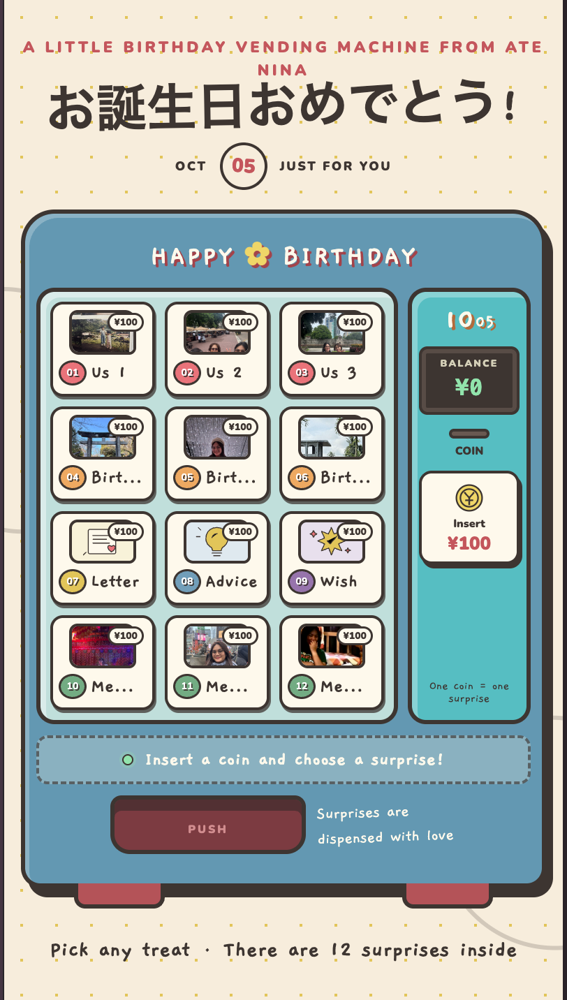

# Birthday Vending Machine 🎁

An interactive birthday website made for my sister, Bianca, on her
27th birthday. Inspired by Japanese vending machines, it dispenses
family photos, memories, a birthday letter, advice, and wishes.

## Screenshots

### Vending Machine

## Features

- Gift opening screen with a birthday greeting
- Virtual coins that add ¥100 to the balance
- 12 surprises, each costing ¥100
- Balance checks before dispensing a surprise
- Pop-up cards containing photos and personal messages
- Responsive layout for mobile and desktop

## Tech Stack

- React
- TypeScript
- CSS
- Vite

## How I Built It

I used **Figma Make to generate the initial design and code**, then
continued developing the project in VS Code.

I personalized the photos and messages and added an interactive
birthday introduction with React state and CSS animations.

This project gave me hands-on practice reading generated code,
understanding React components, managing state, and modifying an
existing application.

## Run Locally

Requires Node.js and npm.

1. Clone the repository:

   git clone https://github.com/ninadaninja/birthday-vending-machine.git

2. Open the project folder:

   cd birthday-vending-machine

3. Install dependencies:

   npm install

4. Start the development server:

   npm run dev

Open the local URL displayed in your terminal.

## Build for Production

Run:

    npm run build

Vite generates the production files in the `dist` folder.

## Personalizing the Content

The product content is defined in `src/App.tsx`.

Photos are stored in `public/birthday-assets` and referenced like this:

    imageSrc: "/birthday-assets/photo-name.png"

Each product contains its title, description, image information,
category, and accent color.

## Future Improvements

- Replace the gift emoji with my own hand-drawn illustrations
- Add an animation of the gift lid opening
- Add vending and coin sound effects with a mute option
- Split the introduction and vending machine into separate components
- Rebuild the experience in plain JavaScript to strengthen my fundamentals

## Credits

Created by Nina Galindo, with an initial scaffold generated by
Figma Make.

Made with love for Bianca ♡
